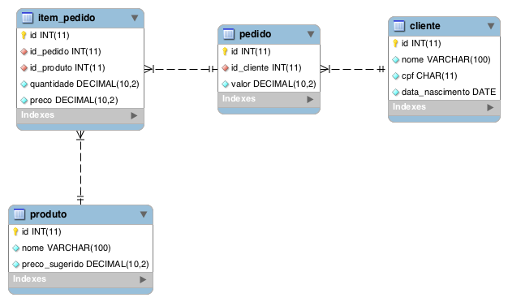

# Quero ser Paguer

## Texto foda para convidar os dev's back-end a fazer parte deste time TOP!

Faça o Fork deste projeto e desenvolva uma API REST em Java com o seguinte modelo de dados:

> **PS:** Não precisa fazer o Pull Request, apenas mande um e-mail para <queroserpaguer@meupag.com.br> com o link do seu **github**

### Bônus
- Spring boot
- Cache de segundo nível
- Controle de acesso
- API Documentada
- Teste Unitário
- Database Migration
- Bean Validation
