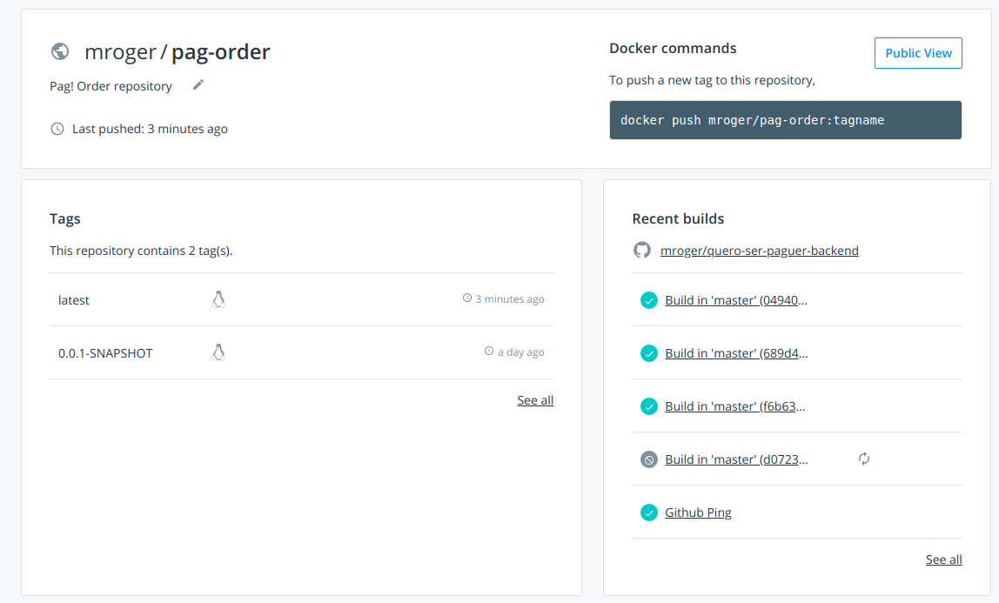

# Pag! order

This API is responsible for maintaining clients's orders of Pag! products.

##  Technical features

* Configured actuators
* MySQL driver configuration
* Multi-stage Dockerfile
* Docker compose script for MySQL and Application service images
* Liquibase for database migration
* Use of clean code and good OO principles
* i18n message bundles for API response messages
* Spring Cloud Sleuth and Zipkin client configured
* Log instrumented to show distributed tracing
* Log rotation configured to rotate daily
* Swagger2 API documentation
* HATEOAS implementation

API's base URL http://localhost:9090/pag-order

## Building docker image

* Cd into project's folder and execute

`$ docker build -t mroger/pag-order:latest .`

## Starting Pag! Order Service and Database

* Cd into project's folder
* Start the services

`$ docker-compose up -d`

* Apply the database migration

`$ mvn liquibase:update`

* Verify that the application is UP accessing this URL in the browser

[API Health actuator](http://localhost:9090/pag-order/actuator/health)

with the result: `{"status":"UP"}`

## API documetation

[Pag! Order API](http://localhost:9090/pag-order/swagger-ui.html)

## Resources

* Postman collection on folder `postman`

* Docker image on [Docker Hub](https://cloud.docker.com/repository/docker/mroger/pag-order/general):

## Logs

* The application logs are generated in folder `logs` and the archived logs are in folder `logs/archive`
