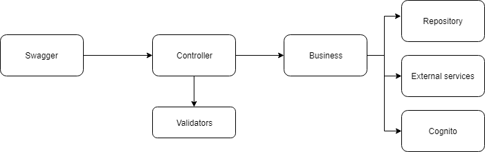

# Api de clientes

A API de cliente é responsável pela manipulação e criação de clientes na plataforma.

## Plataforma

O projeto foi desenvolvido em NodeJS 10 utilizando as seguintes bibliotecas/módulos

 - Sequelize - ORM para manipulação de dados 
 - Swagger - No caso está sendo utilizado o pacote `swagger-node` , ele é responsável por rotear a API e definir objetos de requisição e resposta, além de validações básicas
 - Express - Framework para criação de aplicativos web javascript
## Arquitetura 
Visando entregar algo modular e de prática manutenção com regras de negócio centralizada, foram adotadas o seguinte padrão de organização de pastas e componentes:

 - **Swagger** - Realiza a validação dos objetos requisitados e direciona para controller selecionada
 - **Controller** - Realiza validações um pouco mais complexas como a verificação do numero do CPF e direciona para camada business a qual irá manipular o objeto e definir o retorno 
 - **Business** - Realiza a chama de serviços externos e da camada repository que persiste dados na base
 - **Repository** - Realiza a persistência de dados na base, note que para essa camada é utilizada uma variação sintática do JS, visando uma melhor organização do código. 
